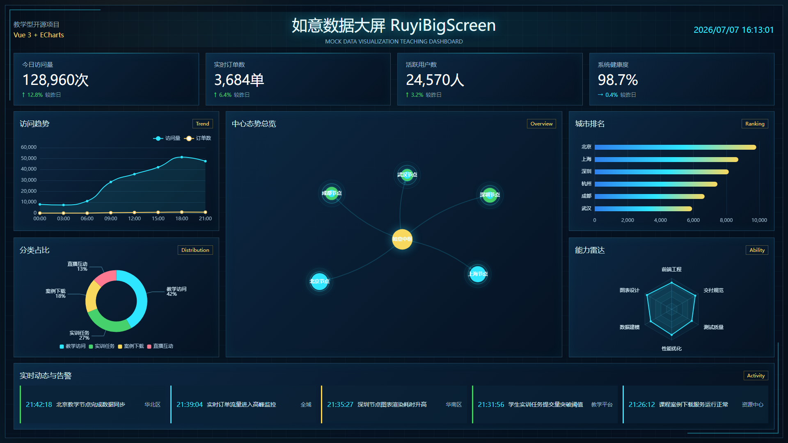

# AI-Ops-Visual-Dashboard｜AI运维可视化大屏
AI-Ops-Visual-Dashboard 是面向AIOps运维场景的前端实训大屏项目，使用 Vue 3、TypeScript 和 ECharts 搭建完整运维监控可视化工程，覆盖指标展示、实时模拟数据流、全局状态管理、单元自动化测试全流程，适合前端运维可视化课程作业。

## 项目预览


## 项目简介
本项目面向前端开发、运维可视化、AIOps实训学习者，纯前端实现，默认使用Mock数据模拟企业IT运维监控指标，完整演示运维大屏页面布局、图表封装、数据分层、工程化规范整套流程。
项目为教学实训案例，无后端服务依赖，本地Mock即可运行，支持无缝切换真实后端API数据源。

## 核心特性
- 16:9标准大屏深色科技布局，适配课堂展示与作业交付截图
- Vue3 + TS 分层封装页面、通用组件、运维图表模块
- ECharts封装系统流量趋势、服务占比、节点负载、服务健康雷达、业务拓扑总览
- Pinia统一管理大屏加载状态与全局运维指标数据
- Mock模式提供稳定模拟运维监控数据，本地开箱即用
- Axios请求层预留API切换能力，通过环境变量一键切换数据源
- Vitest覆盖工具函数、运维服务单元校验
- Playwright自动化页面渲染、控制台异常检测、自动截图
- ESLint、Prettier、Stylelint统一代码规范，保障工程整洁
- 自动化截图脚本，一键生成作业展示封面图

## 技术栈
- 前端框架：Vue 3、Vite、TypeScript
- 可视化图表：ECharts
- 状态管理：Pinia
- 数据请求：Axios、分层Service服务
- 模拟数据：MSW、实时运维指标模拟器
- 单元测试：Vitest、Vue Test Utils
- E2E自动化：Playwright
- 代码规范：ESLint、Prettier、Stylelint

## 页面内容
- 顶部标题与实时时钟：展示“AI运维可视化大屏 AI-Ops-Dashboard”系统运行时间
- 核心运维指标卡片：今日服务请求量、实时故障工单、在线活跃节点、系统整体健康度
- 流量趋势图表：展示服务器访问流量、异常请求滑动时序曲线
- 服务分类占比：业务服务、中间件、数据库、网关负载占比分析
- 运维中心拓扑总览：以运维中枢为核心，展示各业务节点数据流关系
- 城市机房负载排名：各地区服务器集群负载降序展示
- 运维能力雷达图：系统监控、告警处理、故障排查、日志分析、资源调度维度评分
- 实时告警动态：滚动展示系统异常、服务下线、资源超限等运维事件

## Mock 运维数据
项目默认启用前端Mock模拟运维监控数据，页面加载自动拉取指标集：
- 顶部核心健康指标来自运维汇总Mock接口
- 流量趋势、服务占比、机房负载、能力雷达均由模拟数据集提供
- 拓扑总览使用节点关系Mock数据构建业务流转图
- 实时告警列表自动生成滚动运维事件日志
所有数据仅为教学模拟，不对接真实生产运维环境。

## 项目结构
```text
src/
  app/              # 全局入口、全局样式配置
  assets/           # 静态图片、全局主题样式
  charts/           # 封装各类运维ECharts图表组件
  components/       # 通用卡片、告警、表格公共组件
  layouts/          # 大屏整体布局容器
  logs/             # 前端日志封装工具
  mocks/            # 运维模拟数据、MSW拦截规则
  services/         # 运维指标服务、数据源切换层
  stores/           # Pinia全局状态仓库
  tests/            # 单元测试、E2E自动化测试用例
  types/            # TypeScript运维指标类型定义
  utils/            # 时间格式化、图表自适应工具
views/
  DashboardView.vue # 运维大屏主页面
docs/
  screenshots/      # README作业展示截图存放目录
scripts/
  capture-dashboard.mjs # 自动截图脚本